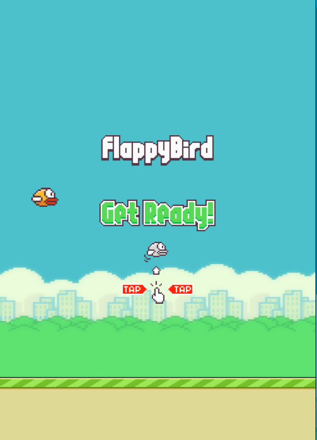
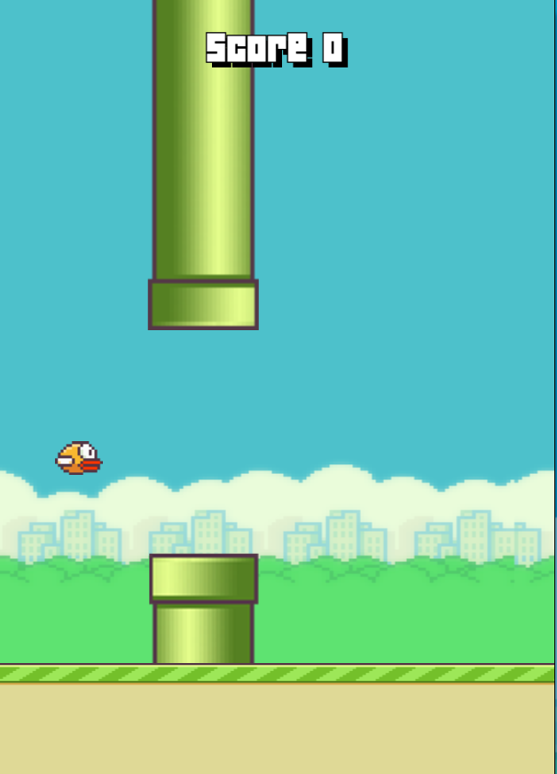
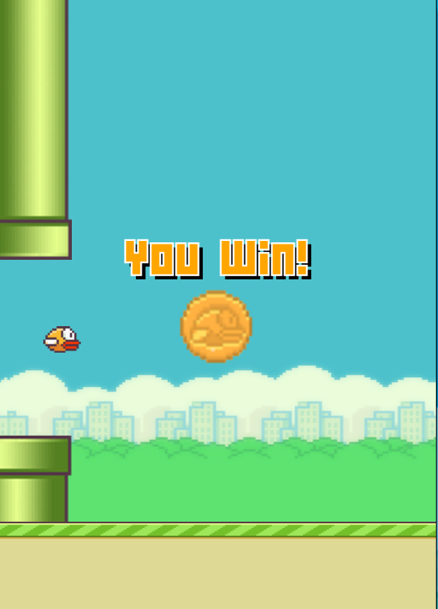
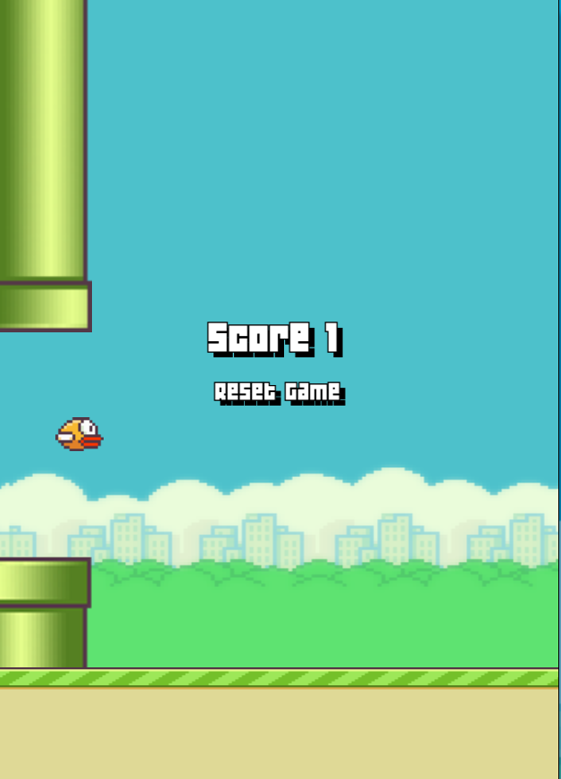

# Flappy Bird

##### https://p1-flappy-bird.vercel.app/

#### Introduction

This is a clone of the game 'Flappy Bird' where the player attempts to fly between columns of green pipes without colliding with them.

---

#### Screenshots

 

---

#### Technologies Used

- HTML
- CSS
- JavaScript

---

#### Getting Started

To play the game, either click anywhere within the game container or use the spacebar to make the bird jump between the columns.

---

#### Next Steps

- Ability to pick the sprite to use as the player
- Better animations such as animations for when the bird jumps and drops
- Better implementation of randomizing and generating the tubes
- Generate more tubes for each iteration
- Different levels of difficulty
